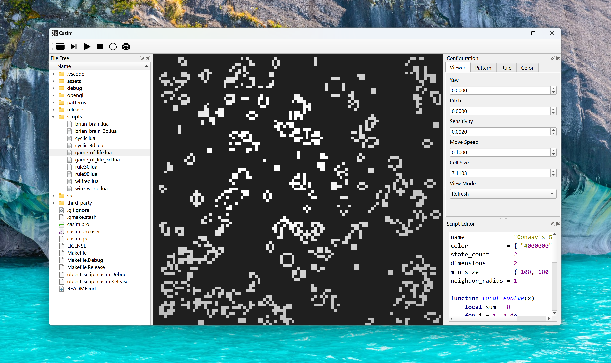

# CASIM

**C**ellular **A**utomata **SIM**ulator

A simulator for cellular automata using lua to define rules, available for 3D CA.

## Usage

1. Make sure that qt and opengl is well configured
2. `qmake && make`

## Dependencies

Casim depends on `xtensor` `xlt` and `lua`. The licenses of these libraries are placed under `third_party`

## RoadMap

- [ ] Performance optimization
- [ ] Auto adjusting for viewer
- [ ] Error handling for Automaton
- [x] Neighbor radius from script
- [x] Messages & information
